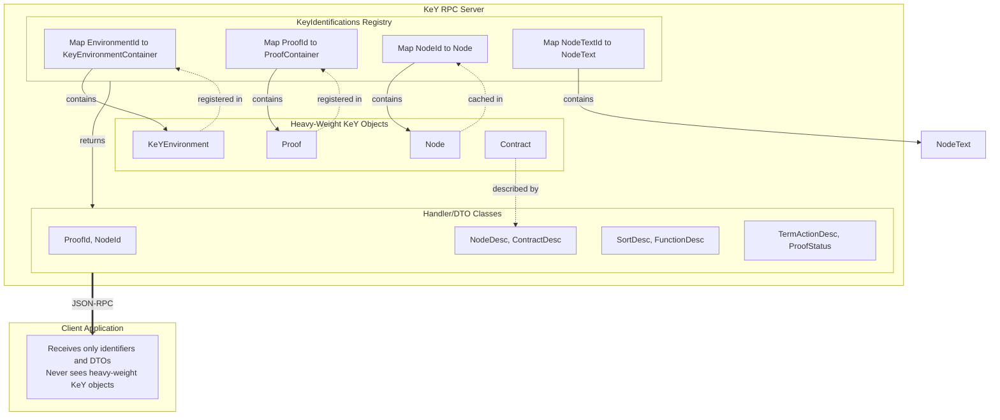

# Handler Data Classes and the Proxy Pattern

## Overview

The KeY JSON-RPC API uses a **proxy pattern** to communicate between the RPC server and the heavy-weight objects of the KeY theorem prover system. This document explains why proxy classes are necessary and provides a comprehensive mapping between KeY system classes and their corresponding handler (DTO) classes.

## Why Proxy Classes Are Necessary

### Heavy-Weight Objects in KeY

The KeY theorem prover contains many complex, heavy-weight objects that:

1. **Cannot be serialized**: Many KeY objects contain references to GUI components, file handles, or native resources that cannot be serialized to JSON.

2. **Have complex object graphs**: Objects like `Proof`, `Node`, and `KeYEnvironment` contain deep hierarchies with circular references, making direct serialization impractical.

3. **Are stateful and mutable**: The proof state changes during verification, requiring careful management of object identity and lifecycle.

4. **Contain expensive computations**: Some objects cache results of expensive computations that should not be transferred over the network.

5. **Have JVM-specific references**: Many objects reference Java-specific constructs that would be meaningless to external clients.

### The Solution: Identifier-Based Proxies

Instead of transferring heavy-weight objects directly, the API uses a **two-layer approach**:

1. **Server-side registry**: The `KeyIdentifications` class maintains registries (`KeyEnvironmentContainer`, `ProofContainer`) that map lightweight identifiers to heavy-weight KeY objects.

2. **Client-side identifiers**: Clients receive and send only lightweight identifier records (e.g., `ProofId`, `NodeId`) that reference server-side objects.

3. **Data Transfer Objects (DTOs)**: When data needs to be transferred, it is converted into serializable DTO records containing only the necessary information.



## Registry Architecture

### KeyIdentifications Class

The central registry is implemented in `KeyIdentifications.java`:

```java
public class KeyIdentifications {
    private final Map<EnvironmentId, KeyEnvironmentContainer> mapEnv = new HashMap<>(16);
    
    // Nested container classes
    public record KeyEnvironmentContainer(KeYEnvironment<?> env,
            Map<ProofId, ProofContainer> mapProof) { ... }
    
    private record ProofContainer(Proof wProof,
            Map<NodeId, Node> mapNode,
            Map<TreeNodeId, TreeNodeDesc> mapTreeNode,
            Map<NodeTextId, NodeText> mapGoalText) { ... }
}
```

This creates a hierarchical registry:
- `EnvironmentId` → `KeYEnvironment`
  - `ProofId` → `Proof`
    - `NodeId` → `Node`
    - `TreeNodeId` → `TreeNodeDesc`
    - `NodeTextId` → `NodeText`

### Lifecycle Management

The registry provides explicit disposal methods to clean up resources:

```java
public void dispose(NodeTextId nodeTextId) { ... }
public void dispose(ProofId id) { ... }
public void dispose(EnvironmentId id) { ... }
```

Clients must call `freePrint()` for `NodeTextId` resources and `dispose()` for proofs when done.

## Class Correspondences: KeY System to Handler Classes

The following table lists all correspondences between heavy-weight KeY system classes and their lightweight handler/DTO counterparts:

### Identifier Classes (KeyIdentifications)

| Handler/DTO Class | Purpose | Contains |
|-------------------|---------|----------|
| `EnvironmentId` | Identifies a KeY environment instance | `envId: String` |
| `ProofId` | Identifies a loaded proof | `env: EnvironmentId`, `proofId: String` |
| `ContractId` | Identifies a contract specification | `envId: EnvironmentId`, `contractId: String` |
| `NodeId` | Identifies a proof tree node | `proofId: ProofId`, `nodeId: String` (serial number) |
| `TreeNodeId` | Simple string identifier for tree nodes | `id: String` |
| `NodeTextId` | Identifies printed node text | `nodeId: NodeId`, `nodeTextId: int` |
| `TermActionId` | Identifies a term action command | `nodeTextId: NodeTextId`, `pio: String`, `id: String`, `caretPos: int` |

### Proof-Related Classes

| Handler/DTO Class | KeY System Class | Description |
|-------------------|------------------|-------------|
| `NodeDesc` | `de.uka.ilkd.key.proof.Node` | Proof node with branch label, children, rule application info |
| `TreeNodeDesc` | `de.uka.ilkd.key.proof.Node` | Simplified tree node with just ID and name |
| `NodeText` | `de.uka.ilkd.key.pp.InitialPositionTable` + formatted text | Printed sequent with position table |
| `NodeTextDesc` | Combination of `Node`, `LogicPrinter`, `PositionTable` | Full print-out description with terms and taclet info |
| `ProofStatus` | `de.uka.ilkd.key.proof.Proof` | Proof state summary (open/closed goals count) |
| `ProofMacroDesc` | `de.uka.ilkd.key.macros.ProofMacro` | Available proof macro description |
| `ProofScriptCommandDesc` | `de.uka.ilkd.key.scripts.ProofScriptCommand` | Script command description |
| `MacroStatistic` | `de.uka.ilkd.key.macros.ProofMacroFinishedInfo` | Macro execution statistics |
| `MacroDescription` | `de.uka.ilkd.key.macros.ProofMacro` | Alternative macro description format |

### Environment/Logic Classes

| Handler/DTO Class | KeY System Class | Description |
|-------------------|------------------|-------------|
| `SortDesc` | `org.key_project.logic.sort.Sort` | Sort/type declaration with documentation |
| `FunctionDesc` | `org.key_project.logic.op.Function` | Function symbol with signature |
| `PredicateDesc` | N/A (derived from function namespace) | Predicate symbol with argument sorts |
| `ContractDesc` | `de.uka.ilkd.key.speclang.Contract` | Contract specification with HTML/plain text |

### Term Action Classes

| Handler/DTO Class | KeY System Class | Description |
|-------------------|------------------|-------------|
| `TermActionDesc` | Derived from `PosInSequent` + available rules | Describes an applicable proof action |
| `TermActionKind` | N/A | Enum: BuiltIn, Script, Macro, Taclet |
| `NodeTextSpan` | Position ranges from `InitialPositionTable` | Hierarchical text spans for term selection |

### Configuration/Parameter Classes

| Handler/DTO Class | Related KeY Classes | Description |
|-------------------|---------------------|-------------|
| `LoadParams` | Used by `AbstractProblemLoader` | Parameters for loading problems |
| `ProblemDefinition` | Used to construct `InitConfig` | Custom problem definition |
| `PrintOptions` | Used by `LogicPrinter`, `PosTableLayouter` | Options for sequent printing |
| `StrategyOptions` | `de.uka.ilkd.key.strategy.StrategyProperties` | Proof strategy configuration |
| `Uri` | N/A | Wrapper for file paths/URIs |
| `TextRange` | N/A | Start/end character positions |

### Notification/Event Classes

| Handler/DTO Class | KeY System Class | Description |
|-------------------|------------------|-------------|
| `TaskStartedInfo` | `org.key_project.prover.engine.TaskStartedInfo` | Task start notification |
| `TaskFinishedInfo` | `org.key_project.prover.engine.TaskFinishedInfo` | Task completion notification |
| `TraceValue` | N/A | Logging level enum |

### Example Classes

| Handler/DTO Class | KeY System Class | Description |
|-------------------|------------------|-------------|
| `ExampleDesc` | `de.uka.ilkd.key.gui.Example` | Built-in example description |

## Conversion Patterns

### Static Factory Methods

Most DTO classes provide static `from()` methods for conversion:

```java
// Example: Converting a KeY Sort to SortDesc
public static SortDesc from(Sort sort) {
    return new SortDesc(
        sort.name().toString(), 
        sort.getDocumentation(),
        sort.extendsSorts().stream().map(SortDesc::from).toList(),
        sort.isAbstract(), 
        sort.declarationString()
    );
}

// Example: Converting a KeY Contract to ContractDesc
public static ContractDesc from(EnvironmentId envId, Services services, Contract it) {
    return new ContractDesc(
        new ContractId(envId, it.getName()),
        it.getName(), 
        it.getDisplayName(), 
        it.getTypeName(),
        it.getHTMLText(services), 
        it.getPlainText(services)
    );
}
```

### In-Line Conversion in KeyApiImpl

Many conversions happen directly in the API implementation:

```java
private NodeDesc asNodeDesc(ProofId proofId, Node it) {
    return new NodeDesc(
        new NodeId(proofId, "" + it.serialNr()), 
        it.getNodeInfo().getBranchLabel(),
        it.getNodeInfo().getScriptRuleApplication(), 
        collectPathInformation(it)
    );
}
```

## Best Practices for Using the Proxy Pattern

1. **Always use identifiers**: Never attempt to serialize KeY objects directly. Always convert to DTOs first.

2. **Manage resource lifecycle**: Call disposal methods when done with `NodeTextId`, `ProofId`, or `EnvironmentId` resources.

3. **Cache sparingly**: The server maintains caches (e.g., `mapNode`, `mapGoalText`). Trust the registry rather than duplicating state on the client.

4. **Use hierarchical IDs**: Notice that IDs form a hierarchy (`ProofId` contains `EnvironmentId`, `NodeId` contains `ProofId`, etc.). This ensures proper scoping.

5. **Understand what's cached vs. computed**: 
   - `Node` objects are cached in `ProofContainer.mapNode`
   - `NodeText` objects are created on-demand and must be explicitly freed

## Summary

The proxy pattern in key-rpc enables safe, efficient remote access to the KeY theorem prover by:

- **Isolating complexity**: Heavy-weight KeY objects stay on the server
- **Enabling serialization**: Only JSON-compatible DTOs cross the network
- **Managing lifecycle**: Explicit registration and disposal of resources
- **Preserving identity**: Hierarchical identifiers maintain object relationships

This architecture allows clients in any language to interact with KeY without needing to understand its internal object model.