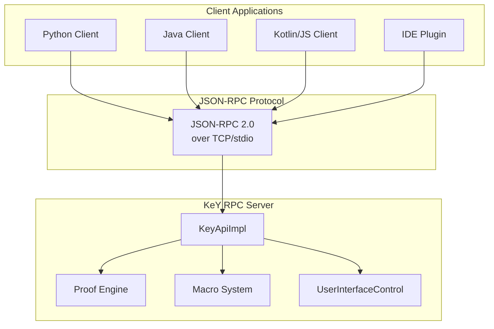

# key-rpc
The JSON-RPC interface for the KeY theorem prover

## Overview

**key-rpc** provides a powerful JSON-RPC based remote procedure call interface to the [KeY theorem prover](https://key-project.org), enabling seamless integration with external tools, IDEs, and automation systems.

This implementation leverages the [Eclipse LSP4J JSON-RPC](https://github.com/eclipse-lsp4j/lsp4j) library to provide a standardized, language-agnostic communication protocol between the KeY prover and client applications.

## Benefits of RPC Architecture

### Language Flexibility
The JSON-RPC protocol enables **versatile caller languages**. Clients can be implemented in any programming language that supports JSON-RPC, including:
- **Python** - See `keyext.client.python/` for a reference Python client implementation
- **Java** - Native integration via the `keyext.api.client` module
- **Kotlin/JavaScript** - Multiplatform client support via `keyext.api.ktclient`
- **Any language** with JSON-RPC libraries (Node.js, C#, Go, Rust, etc.)

### Architectural Flexibility
- **Decoupled Design**: The prover runs as a separate process, independent of the client application
- **Cross-Process Communication**: Clients can run locally or remotely
- **Stateful Sessions**: The server maintains proof state across client connections, allowing reconnection and session resumption
- **Async/Sync Operations**: Support for both synchronous requests and asynchronous notifications

### Integration Capabilities
- **IDE Plugins**: Embed KeY verification directly into development environments
- **CI/CD Pipelines**: Automated theorem proving as part of build processes
- **Research Tools**: Build custom analysis and visualization tools on top of KeY
- **Educational Applications**: Create interactive learning environments for formal verification

## Module Structure

```
key-rpc/
├── keyext.api/           # Core API definitions and server implementation
│   └── src/main/java/org/keyproject/key/api/
│       ├── KeyApiImpl.java    # Main server implementation
│       ├── remoteapi/         # Server-side API interfaces
│       │   ├── KeyApi.java        # Combined API interface
│       │   ├── ProofApi.java      # Proof manipulation operations
│       │   ├── ExampleApi.java    # Example management
│       │   ├── EnvApi.java        # Environment/sort/function queries
│       │   └── ...
│       ├── remoteclient/      # Client callbacks (notifications)
│       └── data/              # Data transfer objects (DTOs)
│
├── keyext.api.client/    # Java client implementation
├── keyext.api.ktclient/  # Kotlin multiplatform client
├── keyext.client.python/ # Python client implementation
└── server.py             # Python server launcher
```

## API Categories

### Proof Management (`proof/*`)
- `proof/root` - Get the root node of a proof tree
- `proof/tree` - Retrieve complete proof tree structure
- `proof/goals` - List open/enabled goals
- `proof/macro` - Execute proof macros
- `proof/script` - Run proof scripts
- `proof/auto` - Start automatic proof search
- `proof/dispose` - Free proof resources
- `proof/save` - Save proof to file

### Environment Queries (`env/*`)
- `env/sorts` - List available sorts
- `env/functions` - List available functions
- `env/contracts` - List proof contracts
- `env/openContract` - Open a contract for proving

### Loading (`loading/*`)
- `loading/loadExample` - Load built-in examples
- `loading/loadKey` - Load `.key` proof obligation files
- `loading/loadTerm` - Load a logical term directly
- `loading/loadProblem` - Load complex problem definitions

### Metadata (`meta/*`)
- `meta/version` - Get KeY version
- `meta/available_macros` - List available proof macros
- `meta/available_script_commands` - List script commands

### Goal Interaction (`goal/*`)
- `goal/print` - Render goal sequent as text
- `goal/actions` - Get applicable taclet actions at cursor position
- `goal/apply_action` - Apply selected proof action
- `goal/free` - Release cached print data

## Client Usage Example (Python)

```python
from keyext.client.python.keyapi.server import KeyClient

# Connect to the RPC server
client = KeyClient(endpoint="localhost:5007")

# List available examples
examples = client.examples_list()
print(f"Available examples: {[e.name for e in examples]}")

# Load an example proof
proof_id = client.loading_loadExample("java/card/TransferMoney")

# Get proof status
status = client.proof_auto(proof_id, StrategyOptions())
print(f"Proof status: {status.status}")

# Navigate proof tree
root = client.proofTree_root(proof_id)
children = client.proofTree_children(proof_id, root.id)
```

## Data Model

The API uses structured DTOs (Data Transfer Objects) for all operations. All data types implement the `KeYDataTransferObject` marker interface.

### Core Identifiers

| Type | Description |
|------|-------------|
| `EnvironmentId` | Identifier for KeY environment instances |
| `ProofId` | Unique identifier for loaded proofs (contains `EnvironmentId`) |
| `ContractId` | Identifier for contracts (contains `EnvironmentId`) |
| `NodeId` | Reference to proof nodes (contains `ProofId`) |
| `TreeNodeId` | Simple string identifier for tree nodes |
| `NodeTextId` | Reference to printed node text (contains `NodeId`) |
| `TermActionId` | Reference to term actions (contains `NodeTextId`) |

### Descriptions and Results

| Type | Description |
|------|-------------|
| `ExampleDesc` | Built-in example description |
| `ContractDesc` | Contract description with HTML/plain text |
| `SortDesc` | Sort/Type description with documentation |
| `FunctionDesc` | Function signature with argument/return sorts |
| `PredicateDesc` | Predicate definition with argument sorts |
| `NodeDesc` | Proof node with children, branch labels, rule applications |
| `TreeNodeDesc` | Tree node reference with name |
| `NodeTextDesc` | Formatted sequent text with position table |
| `NodeTextSpan` | Position range with nested spans for term selection |
| `TermActionDesc` | Applicable proof action with category and kind |
| `ProofStatus` | Proof state (open/closed goals count) |
| `MacroStatistic` | Macro execution statistics |
| `ProofMacroDesc` | Available proof macro description |
| `ProofScriptCommandDesc` | Script command description |

### Configuration and Parameters

| Type | Description |
|------|-------------|
| `LoadParams` | Problem loading parameters (file, classpath, includes) |
| `ProblemDefinition` | Custom problem with sorts, functions, predicates, terms |
| `PrintOptions` | Sequent printing options (unicode, width, indentation) |
| `StrategyOptions` | Proof strategy configuration |
| `Uri` | Uniform resource identifier wrapper |
| `TextRange` | Start/end character positions |

### Notifications and Events

| Type | Description |
|------|-------------|
| `TaskStartedInfo` | Task start notification with message and size |
| `TaskFinishedInfo` | Task completion with applied rules and closed goals |
| `TraceValue` | Logging level enum (Off, Error, Warning, Info, Log, Debug) |

## Data Structure Component Diagram

```mermaid
flowchart TB
    subgraph "Identifiers (KeyIdentifications)"
        EnvId[EnvironmentId]
        ProofId[ProofId<br/>env: EnvironmentId<br/>proofId: String]
        ContractId[ContractId<br/>envId: EnvironmentId<br/>contractId: String]
        NodeId[NodeId<br/>proofId: ProofId<br/>nodeId: String]
        TreeNodeId[TreeNodeId<br/>id: String]
        NodeTextId[NodeTextId<br/>nodeId: NodeId<br/>nodeTextId: int]
        TermActionId[TermActionId<br/>nodeTextId: NodeTextId<br/>pioId: String<br/>id: String<br/>caretPos: int]
    end

    subgraph "Domain Descriptions"
        ExampleDesc[ExampleDesc<br/>name, description]
        ContractDesc[ContractDesc<br/>contractId, name, displayName<br/>typeName, htmlText, plainText]
        SortDesc[SortDesc<br/>string, documentation<br/>extendsSorts, anAbstract, s]
        FunctionDesc[FunctionDesc<br/>name, sort, retSort<br/>argSorts, rigid, unique,<br/>skolemConstant]
        PredicateDesc[PredicateDesc<br/>name, argSorts]
        ProofMacroDesc[ProofMacroDesc<br/>name, category, description<br/>scriptCommandName]
        ProofScriptCommandDesc[ProofScriptCommandDesc<br/>macroId, documentation]
    end

    subgraph "Proof Structures"
        NodeDesc[NodeDesc<br/>nodeid: NodeId<br/>branchLabel, scriptRuleApplication<br/>children: List, description]
        TreeNodeDesc[TreeNodeDesc<br/>id: NodeId, name]
        NodeText[NodeText<br/>text: String<br/>table: InitialPositionTable]
        NodeTextDesc[NodeTextDesc<br/>id: NodeTextId<br/>sequent: String<br/>terms, tacletAppInfo: String]
        NodeTextSpan[NodeTextSpan<br/>start: int, end: int<br/>children]
    end

    subgraph "Actions and Results"
        TermActionKind[TermActionKind<br/>enum: BuiltIn, Script,<br/>Macro, Taclet]
        TermActionDesc[TermActionDesc<br/>commandId: TermActionId<br/>displayName, description<br/>category, kind: TermActionKind]
        ProofStatus[ProofStatus<br/>id: ProofId<br/>openGoals: int<br/>closedGoals: int]
        MacroStatistic[MacroStatistic<br/>proofId: ProofId<br/>macroId: String<br/>appliedRules: int<br/>closedGoals: int]
    end

    subgraph "Configuration"
        LoadParams[LoadParams<br/>problemFile: Uri<br/>classPath: List<br/>bootClassPath: Uri<br/>includes: List]
        ProblemDefinition[ProblemDefinition<br/>sorts, functions,<br/>predicates, antecTerms,<br/>succTerms]
        PrintOptions[PrintOptions<br/>unicode: bool, width: int<br/>indentation: int, pure: bool<br/>termLabels: bool]
        StrategyOptions[StrategyOptions<br/>method, dep, query<br/>nonLinArith, stopMode<br/>maxSteps: int]
        Uri[Uri<br/>uri: String]
        TextRange[TextRange<br/>start: int, end: int]
    end

    subgraph "Notifications"
        TaskStartedInfo[TaskStartedInfo<br/>message: String, size: int<br/>kind: TaskKind]
        TaskFinishedInfo[TaskFinishedInfo<br/>time: long<br/>appliedRules: int<br/>closedGoals: int]
        TraceValue[TraceValue<br/>enum: Off, Error,<br/>Warning, Info, Log, Debug]
    end

    %% Identifier relationships
    EnvId --> ProofId
    EnvId --> ContractId
    ProofId --> NodeId
    NodeId --> NodeTextId
    NodeTextId --> TermActionId

    %% Domain relationships
    ContractId --> ContractDesc
    SortDesc --> FunctionDesc
    SortDesc --> PredicateDesc
    SortDesc --> SortDesc

    %% Proof structure relationships
    NodeId --> NodeDesc
    NodeDesc --> NodeDesc
    NodeId --> TreeNodeDesc
    NodeId --> NodeTextId
    NodeTextId --> NodeTextDesc
    NodeTextSpan --> NodeTextSpan

    %% Action relationships
    TermActionId --> TermActionDesc
    TermActionKind --> TermActionDesc
    ProofId --> ProofStatus
    ProofId --> MacroStatistic

    %% Configuration relationships
    Uri --> LoadParams
    Uri --> ProblemDefinition
    SortDesc --> ProblemDefinition
    FunctionDesc --> ProblemDefinition
    PredicateDesc --> ProblemDefinition

    %% Notification usage
    TaskStartedInfo -.->|callback| ProofId
    TaskFinishedInfo -.->|callback| ProofId
```



## Architecture Diagram



## Getting Started

### Building the Project

```bash
./gradlew build
```

### Running the Server

```bash
# Via Gradle
./gradlew :keyext.api.app:run

# Or directly with Python
python keyext.client.python/server.py
```

### Connecting a Client

```python
# Python client example
from keyapi.rpc import ServerBase, LspEndpoint

endpoint = LspEndpoint("localhost", 5007)
server = KeyServer(endpoint)

# Make your first RPC call
version = server.meta_version()
print(f"Connected to KeY version: {version}")
```

## OpenRPC Specification

This project aims to support the [OpenRPC specification](https://spec.open-rpc.org/) for machine-readable API documentation. Future work includes:
- Generating OpenRPC metadata from API interfaces
- Auto-generating client SDKs in multiple languages
- Interactive API documentation via GitHub Pages

## License

KeY is licensed under the GNU General Public License Version 2 (GPL-2.0-only).
See the LICENSE file in the project root for details.

## Related Projects

- [KeY Theorem Prover](https://key-project.org) - The core verification system
- [Eclipse LSP4J](https://github.com/eclipse-lsp4j/lsp4j) - Java JSON-RPC library
- [JSON-RPC 2.0 Specification](https://www.jsonrpc.org/specification)
- [Model Context Protocol (MCP)](https://modelcontextprotocol.io) - For AI assistant integration